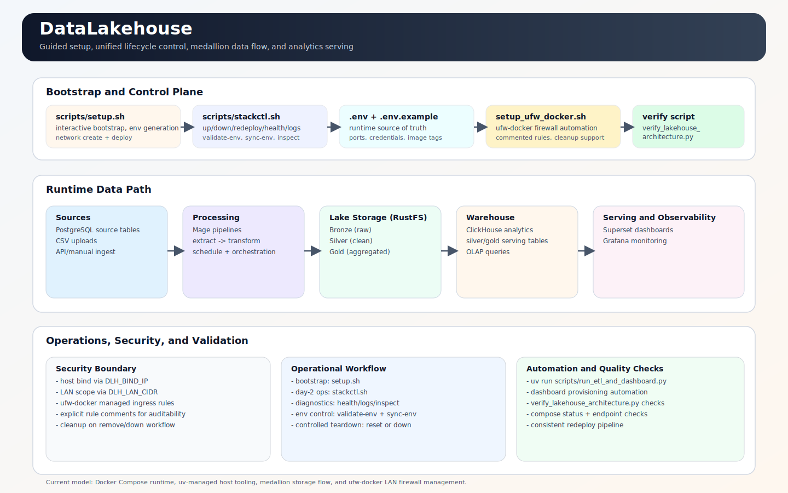

# DataLakehouse

A production-ready, local-first **Data Lakehouse** stack built entirely with Docker Compose.
Implements the Medallion Architecture (Bronze → Silver → Gold), automated ETL pipelines,
OLAP analytics, and business intelligence dashboards — all on a single host.



---

## Stack at a Glance

| Layer | Component | Role |
|-------|-----------|------|
| **Ingest** | PostgreSQL, RustFS Console, CSV/Excel upload | Source data entry points |
| **Storage (Lake)** | RustFS (S3-compatible) | Parquet files in Bronze / Silver / Gold buckets |
| **Process (ETL)** | Mage.ai | Orchestrates Extract → Transform → Load pipelines |
| **Warehouse** | ClickHouse | Columnar OLAP engine — serves analytics queries |
| **Dashboards** | Apache Superset | Business intelligence dashboards |
| **Monitoring** | Grafana | Pipeline operational monitoring |
| **Identity** | Authentik | Centralised SSO and RBAC |
| **Cache / GUI** | Redis Stack | Shared cache/queue for Superset and Authentik + built-in Redis Insight UI |
| **SQL IDE** | CloudBeaver | Web-based SQL client for PostgreSQL and ClickHouse |
| **Docker Mgmt** | Dockhand | Lightweight web-based Docker management UI |
| **Proxy** | Nginx Proxy Manager | Optional TLS reverse proxy |

---

## Service URLs (default ports)

| Service | URL | Credentials |
|---------|-----|-------------|
| RustFS Console | http://localhost:29101 | `RUSTFS_ACCESS_KEY` / `RUSTFS_SECRET_KEY` |
| Mage | http://localhost:26789 | `MAGE_DEFAULT_OWNER_USERNAME` / `MAGE_DEFAULT_OWNER_PASSWORD` |
| Superset | http://localhost:28088 | `SUPERSET_ADMIN_USER` / `SUPERSET_ADMIN_PASSWORD` |
| Grafana | http://localhost:23001 | `GRAFANA_ADMIN_USER` / `GRAFANA_ADMIN_PASSWORD` |
| Authentik | http://localhost:29090 | `AUTHENTIK_BOOTSTRAP_EMAIL` / `AUTHENTIK_BOOTSTRAP_PASSWORD` |
| CloudBeaver | http://localhost:28978 | (configured on first login) |
| Dockhand | http://localhost:23000 | (no auth by default) |
| Nginx Proxy Manager | http://localhost:28081 | (configured on first login) |
| PostgreSQL | localhost:25432 | `POSTGRES_USER` / `POSTGRES_PASSWORD` |
| ClickHouse HTTP | http://localhost:28123 | `CLICKHOUSE_USER` / `CLICKHOUSE_PASSWORD` |
| Redis | localhost:26379 | `REDIS_PASSWORD` |
| Redis Insight | http://localhost:25540 | (add connection manually; use `REDIS_HOST` / `REDIS_PASSWORD`) |

> **Redis Insight** is built into the `redis/redis-stack` image and served from the same
> container as Redis (port 8001 inside the container, mapped to `DLH_REDIS_GUI_PORT`).
> No separate container is required.  On first visit add a connection to
> `dlh-redis:6379` (or `127.0.0.1:6379` from the host) with your `REDIS_PASSWORD`.

All credentials are set in `.env`. Default values are for local development only —
**rotate all passwords before production use.**

---

## Quick Start

### Prerequisites

- Linux / macOS / WSL host
- Docker Engine + Docker Compose plugin
- [`uv`](https://github.com/astral-sh/uv) (host-side Python runner)

```bash
docker --version
docker compose version
uv --version
```

### 1. Clone and install host dependencies

```bash
git clone https://github.com/vuhuudo/DataLakehouse.git
cd DataLakehouse
uv sync --all-groups
```

### 2. Run guided setup (recommended for first deployment)

```bash
bash scripts/setup.sh
```

`setup.sh` will:
1. Prompt for all configuration values (or accept defaults).
2. Write a complete `.env` file.
3. Create the `web_network` Docker network.
4. Start all services with `docker compose up -d`.
5. Optionally run the ETL pipeline and provision Superset dashboards.

### 3. Verify stack health

```bash
bash scripts/stackctl.sh health       # deep health checks
bash scripts/stackctl.sh diagnose     # analyze logs and port conflicts
```

All services should report healthy within 2–3 minutes of startup.

### 4. (Optional) Load sample data and run ETL

```bash
# Interactive
uv run python scripts/run_etl_and_dashboard.py

# Non-interactive (CI mode)
uv run python scripts/run_etl_and_dashboard.py --auto
```

---

## Data Flow

```
PostgreSQL / Excel / CSV
        │
        ▼  [Mage ETL]
 RustFS Bronze  →  Silver  →  Gold   (Parquet, partitioned by date)
        │
        ▼  [load_to_clickhouse]
    ClickHouse analytics DB
        │
        ├──▶ Superset  (business dashboards)
        └──▶ Grafana   (pipeline monitoring)

Redis  →  Superset cache/results + Authentik queue/cache
```

The RustFS object store is the **source of truth** — ClickHouse can be fully
rebuilt from it at any time. All data is never overwritten; each pipeline run
creates a new date-partitioned Parquet file.

---

## Lifecycle Management

All day-2 operations go through `scripts/stackctl.sh`:

```bash
bash scripts/stackctl.sh up                  # start all services
bash scripts/stackctl.sh down                # stop all services
bash scripts/stackctl.sh redeploy            # pull images + recreate containers
bash scripts/stackctl.sh redeploy --with-etl # redeploy + run ETL automatically
bash scripts/stackctl.sh status              # container status
bash scripts/stackctl.sh health              # deep health checks
bash scripts/stackctl.sh logs all            # stream all logs
bash scripts/stackctl.sh logs dlh-mage       # single service logs
bash scripts/stackctl.sh validate-env        # validate .env (port conflicts, blanks)
bash scripts/stackctl.sh reset               # soft reset (keep volumes)
bash scripts/stackctl.sh reset --hard        # hard reset (delete volumes)
bash scripts/stackctl.sh check-system        # architecture validation
```

See [`scripts/README.md`](scripts/README.md) for the full script reference.

---

## Project Structure

```
DataLakehouse/
├── docker-compose.yaml         # Full stack definition
├── .env.example                # Environment variable template
├── pyproject.toml              # Host-side Python dependencies (uv)
│
├── clickhouse/                 # ClickHouse init SQL (schema DDL)
├── grafana/                    # Grafana provisioning (datasources, dashboards)
├── mage/                       # Mage.ai project: pipelines, blocks, utilities
├── postgres/                   # PostgreSQL init scripts (roles, schemas, sample data)
├── superset/                   # Superset configuration (superset_config.py)
├── samples/                    # Sample Excel/CSV files for testing ETL pipelines
│
├── scripts/                    # Operational scripts
│   ├── setup.sh                # Guided initial setup
│   ├── stackctl.sh             # Lifecycle management (up/down/health/logs/reset)
│   ├── run_etl_and_dashboard.py        # ETL trigger + Superset provisioning
│   ├── create_superset_demo_dashboard.py  # Superset dashboard creation via API
│   ├── demo_to_lakehouse.py    # Sample data loader
│   ├── verify_lakehouse_architecture.py   # End-to-end architecture validator
│   ├── maintenance_tasks.py    # ClickHouse backup + RustFS cleanup
│   ├── realtime_watcher.sh     # File-upload event watcher → ETL trigger
│   └── setup_ufw_docker.sh     # Docker-aware UFW firewall management
│
└── docs/
    ├── ARCHITECTURE.md         # Full architecture reference (layers, flow, schema)
    ├── DEPLOYMENT_GUIDE.md     # Step-by-step deployment and operations guide
    ├── PIPELINE_GUIDE.md       # Detailed ETL pipeline block documentation
    ├── VARIABLES_REFERENCE.md  # All .env variables with descriptions and defaults
    ├── OPERATIONS.md           # Day-2 ops: health, backup, restore, Redis, Authentik
    ├── RUSTFS_LAYER_READER_GUIDE.md  # Developer guide for reading RustFS lake layers
    ├── TESTING_CHECKLIST.md    # End-to-end deployment verification checklist
    ├── ai_context.py           # Semantic metadata for AI assistants (Gemini, Copilot)
    └── assets/
        └── datalakehouse-architecture.svg
```

---

## Documentation

| Document | Description |
|----------|-------------|
| [ARCHITECTURE.md](docs/ARCHITECTURE.md) | System layers, component catalog, data flow, ETL pipelines, ClickHouse schema |
| [DEPLOYMENT_GUIDE.md](docs/DEPLOYMENT_GUIDE.md) | Prerequisites, bootstrap flow, day-2 operations, firewall setup, production notes |
| [PIPELINE_GUIDE.md](docs/PIPELINE_GUIDE.md) | Every ETL block explained: variables used, logic, customisation guide |
| [VARIABLES_REFERENCE.md](docs/VARIABLES_REFERENCE.md) | Complete `.env` variable reference with descriptions and example values |
| [OPERATIONS.md](docs/OPERATIONS.md) | Lifecycle commands, health monitoring, backup/restore, Redis/Authentik ops |
| [RUSTFS_LAYER_READER_GUIDE.md](docs/RUSTFS_LAYER_READER_GUIDE.md) | Developer API for reading Bronze/Silver/Gold layers from Python |
| [TESTING_CHECKLIST.md](docs/TESTING_CHECKLIST.md) | Step-by-step verification checklist after deployment or changes |

---

## Firewall and LAN Access

Apply Docker-aware UFW rules:

```bash
bash scripts/setup_ufw_docker.sh
```

Recommended `.env` settings for a split-access setup:

```ini
# UI apps stay local (behind reverse proxy)
DLH_APP_BIND_IP=127.0.0.1

# Database/API ports accessible from LAN
DLH_DATA_BIND_IP=0.0.0.0
UFW_ALLOW_DATA_PORTS=true
DLH_LAN_CIDR=192.168.1.0/24
```

If using an external Nginx Proxy Manager:
1. Attach the NPM container to `web_network`.
2. Use service names as upstream: `dlh-mage:6789`, `dlh-superset:8088`, `dlh-grafana:3000`, etc.

---

## ETL Pipeline Reference

Three pipelines are included:

| Pipeline | Schedule | Source | Output |
|----------|----------|--------|--------|
| `etl_postgres_to_lakehouse` | Every 6 h | PostgreSQL table | RustFS Bronze/Silver/Gold + ClickHouse |
| `etl_excel_to_lakehouse` | Manual / watcher | Excel files in RustFS | ClickHouse project dashboard tables |
| `etl_csv_upload_to_reporting` | Every 5 min | CSV files in RustFS | ClickHouse `csv_clean_rows` |

Run any pipeline immediately:

```bash
# Via stackctl
bash scripts/stackctl.sh redeploy --with-etl

# Via Python script
uv run python scripts/run_etl_and_dashboard.py --auto

# Via Mage UI
# http://localhost:26789 → Pipelines → [pipeline name] → Run Now
```

See [`mage/README.md`](mage/README.md) and [`docs/PIPELINE_GUIDE.md`](docs/PIPELINE_GUIDE.md) for details.

---

## Troubleshooting

### Services not healthy

```bash
bash scripts/stackctl.sh health
bash scripts/stackctl.sh logs all
```

### Port conflicts

```bash
bash scripts/stackctl.sh validate-env
bash scripts/stackctl.sh sync-env
bash scripts/stackctl.sh redeploy
```

### Full rebuild

```bash
bash scripts/stackctl.sh reset --hard
bash scripts/setup.sh
```

### WSL encoding errors in `.env`

```bash
uv run python scripts/run_etl_and_dashboard.py --auto
```

The runner handles BOM/Windows encodings and malformed inherited env values automatically.

### Redis Insight not accessible

Redis Insight is served by the `dlh-redis` container itself (built into `redis/redis-stack`).
It is **not** a separate container. If the UI at `http://localhost:25540` is unreachable:

```bash
# Check that dlh-redis is healthy and port 8001 is mapped
docker compose ps dlh-redis
docker compose logs dlh-redis --tail 50
```

On first visit you will be prompted to add a Redis connection. Use:
- **Host**: `127.0.0.1` (or the container hostname `dlh-redis` from within the stack)
- **Port**: `6379`
- **Password**: value of `REDIS_PASSWORD` in your `.env`

### ClickHouse data missing

ClickHouse schema init only runs once (on first volume creation). To re-apply:

```bash
bash scripts/stackctl.sh reset --hard && bash scripts/setup.sh
```

See [docs/OPERATIONS.md](docs/OPERATIONS.md) for the full recovery procedures reference.

---

## Security Notes

- Rotate **all** `change-*` and `replace-*` passwords in `.env` before production.
- Pin image versions to specific tags (avoid `latest`) in `.env`.
- Use TLS via Nginx Proxy Manager for internet-exposed deployments.
- Restrict `DLH_BIND_IP` and `DLH_LAN_CIDR` to trusted addresses.
- Back up PostgreSQL, ClickHouse, RustFS, and Redis volumes regularly.

---

## License

MIT
